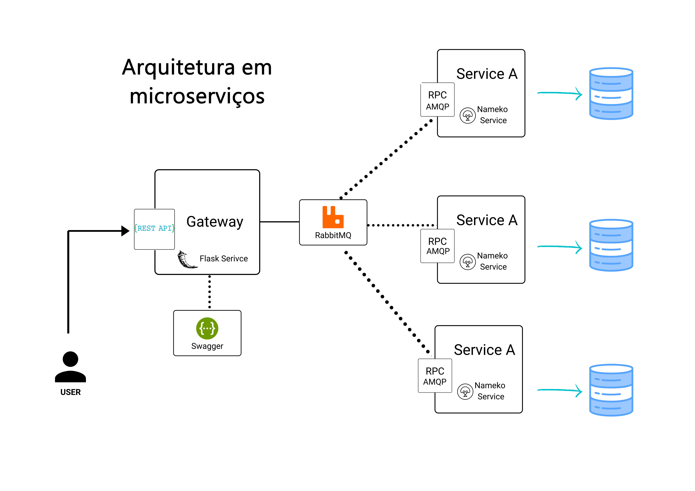
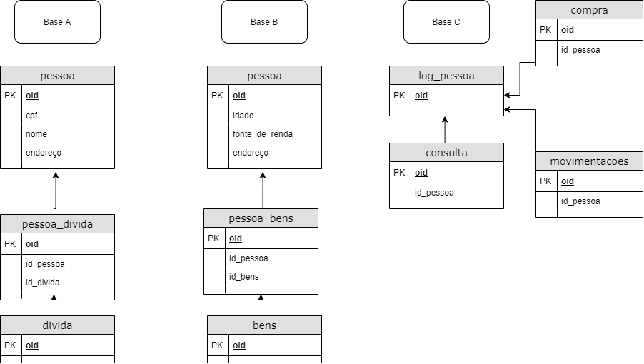

# Documentação

## Tecnologias
Para o desenvolvimento deste exemplo são propostas as seguintes tecnologias. As tecnologias foram escolhidas levando em consideração aceitabilidade da comunidade, conteúdos de exemplo e familiaridade.

### Linguagem

- Python 3.7

### Frameworks/Bibliotecas

- Flask
- Nameko 

### Comunicação

- RabbiMQ

### Protocolos

- REST
- RCP

### Disponibilização

- Docker

### Documentação 

- Swagger

## Arquitetura

Para o desenvolvimento desta solução foi escolhida a arquitetura de microserviços com a estrutura demonstrada no seguinte diagrama:

Principais componentes são:

- **Gateway**: Um serviço Flask no padrão REST API, utilizando comunicação HTTPS para garantias de securança, autenticação e chamada de métodos através de JWT e com documentação publicada através do Swagger.

- **Broker**: RabbitMQ como broker para fazer o encaminhamento das mensagens para o respectivo serviço responder.

- **Service A**: Um serviço nameko que faz comunicação com uma base A, este trafégo de dados, por ser crÍtico, conta com processos de criptografia e faz a comunicação com a base com endereço de origem garantido.

- **Service B**: Um serviço nameko que faz comunicação com uma base B, este trafégo de dados não possui criptografia e faz comunicação com a base com endereço de origem garantido.

- **Service C**: Um serviço nameko que faz comunicação com uma base C, faz comunicação com a base com endereço de origem garantido além de possuir um cache para facilitar a consulta de dados e obter respostas mais rápidas com uma base Redis intermediária.

Foi respeitada a ideia de um arquitetura de nuvem receber uma única entrada de comunicação que pode ser verificada e validada e caso não seja de uma origem confiável é recusada pela camada mais acima.

## Dados

Os seguintes conjuntos de dados foram utilizados por cada uma das bases:

### Referências

- [An introduction to medieval cities and cloud security](https://arcentry.com/blog/an-introduction-to-medieval-cities-and-cloud-security/)
- [Introduction to Python Microservices with Nameko](https://www.toptal.com/python/introduction-python-microservices-nameko)
- [REST OU RPC?](https://medium.com/lfdev-blog/e-agora-api-rest-ou-rpc-c24664d4755b)
- [RabbitMQ and Microservices](https://www.cloudamqp.com/blog/2018-11-02-rabbitmq-and-microservices.html)
- [Don’t Panic! A developer’s guide through the Microservice jungle](https://www.cloudamqp.com/blog/2019-09-11-a-developers-guide-through-the-microservice-jungle.html)
